# ERP GYM

O **ERP GYM** é um sistema de gestão para academias desenvolvido como uma aplicação web full-stack. O sistema centraliza o cadastro de alunos, a operação da academia e o acompanhamento financeiro, conectando uma interface web a uma API responsável pelas regras de negócio e acesso aos dados.

## Funcionalidades

### Autenticação e segurança

* Login com JWT e autenticação segura.
* Controle de acesso baseado em roles (RBAC).
* Permissões definidas de acordo com a função de cada usuário.
* Acesso aos recursos do sistema limitado conforme o role e as permissões atribuídas.
* Separação dos dados por academia utilizando `tenantId`.
* Auditoria de operações importantes.

### Gestão de alunos e academia

* Cadastro e gerenciamento de alunos.
* Cadastro de usuários internos.
* Criação e gerenciamento de planos.
* Controle de matrículas.
* Gestão de modalidades, turmas e horários.
* Registro de presença e check-in.

### Treinos e avaliações

* Criação de fichas de treino.
* Cadastro e gerenciamento de exercícios.
* Registro de avaliações físicas.
* Acompanhamento da evolução dos alunos.

### Financeiro e relatórios

* Controle de cobranças e pagamentos.
* Acompanhamento financeiro da academia.
* Dashboard com indicadores.
* Relatórios em CSV.

## Screenshots

As principais telas do sistema estão disponíveis abaixo, apresentando os diferentes módulos e funcionalidades do ERP GYM.

### Login

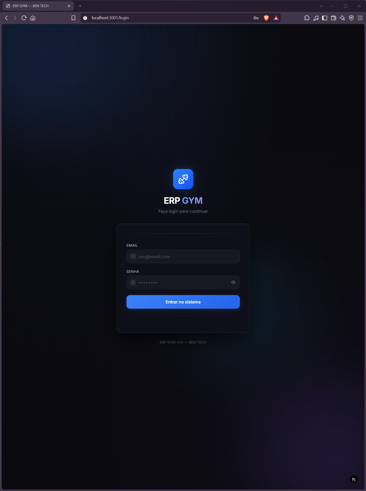

### Dashboard

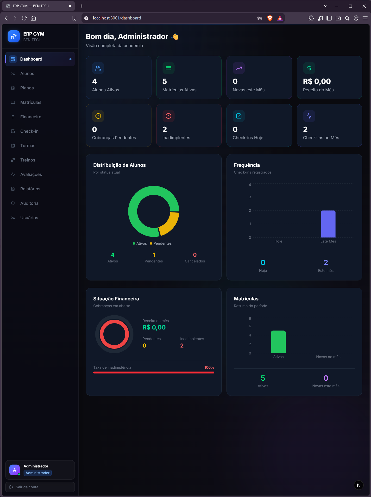

### Gestão de Alunos e Planos

|                      Alunos                     |                    Planos                    |
| :---------------------------------------------: | :------------------------------------------: |
| 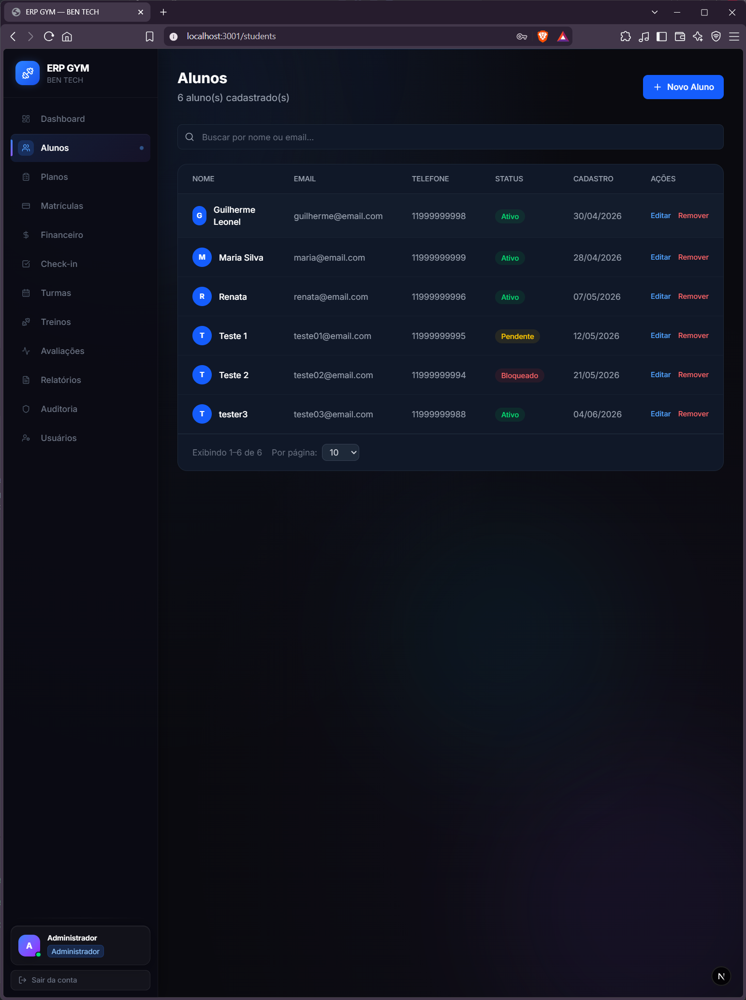 | 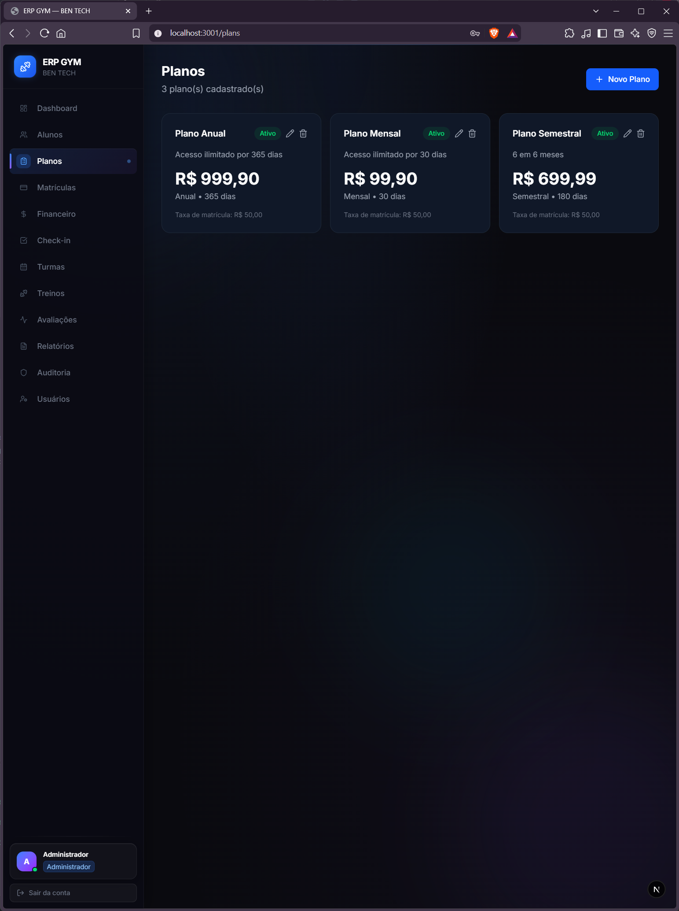 |

### Matrículas e Financeiro

|                       Matrículas                       |                     Financeiro                    |
| :----------------------------------------------------: | :-----------------------------------------------: |
| 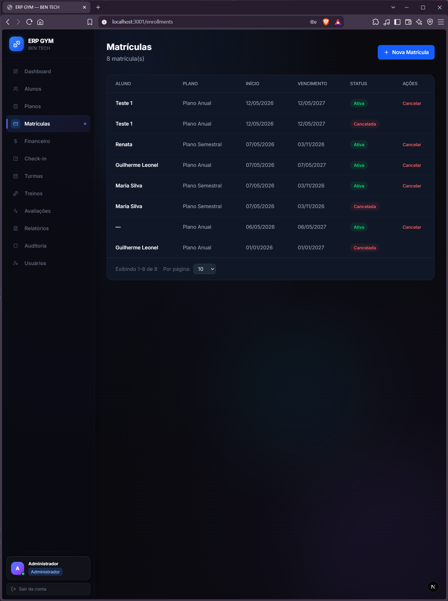 | 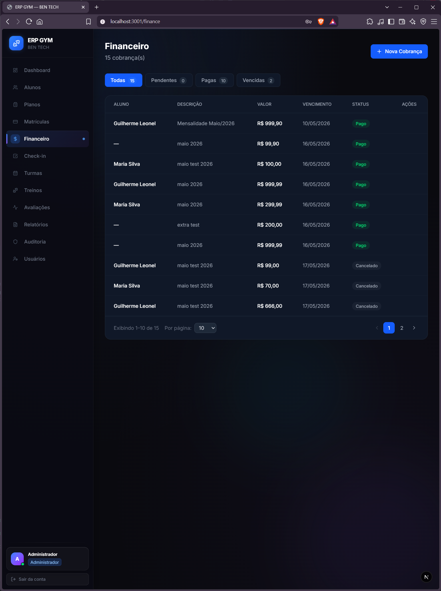 |

### Check-in e Turmas

|                      Check-in                      |                     Turmas                     |
| :------------------------------------------------: | :--------------------------------------------: |
| 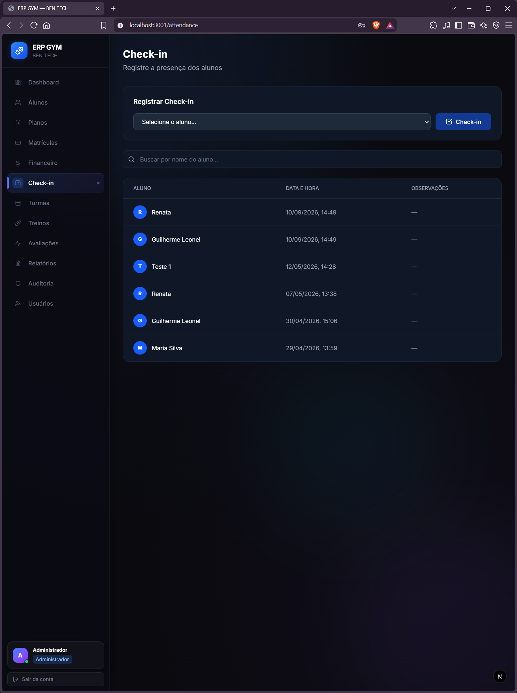 | 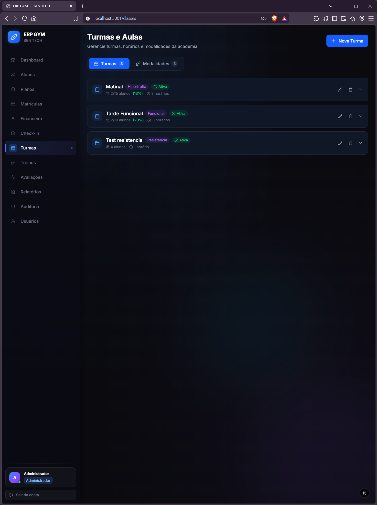 |

### Treinos e Avaliações

|                      Treinos                     |                      Avaliações                      |
| :----------------------------------------------: | :--------------------------------------------------: |
| 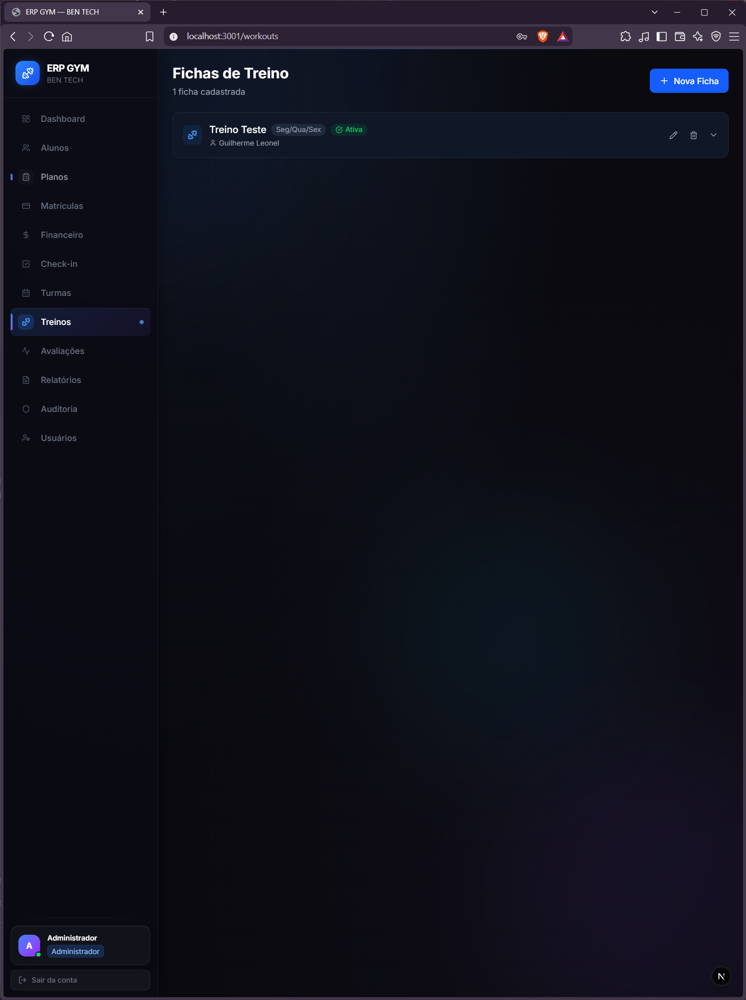 | 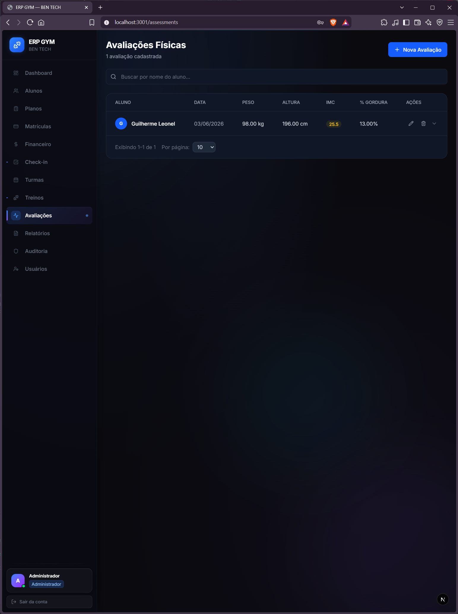 |

### Relatórios e Auditoria

|                Relatórios                |               Auditoria               |
| :--------------------------------------: | :-----------------------------------: |
| 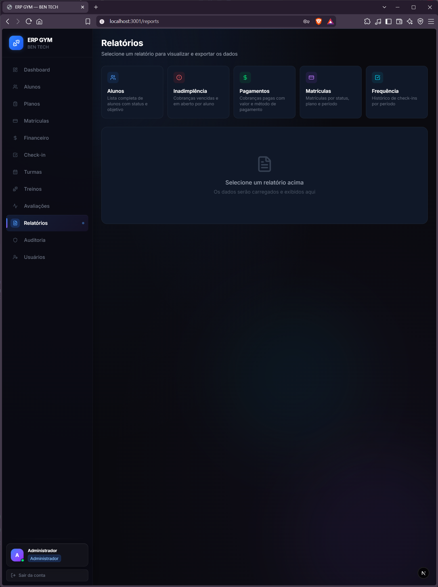 | 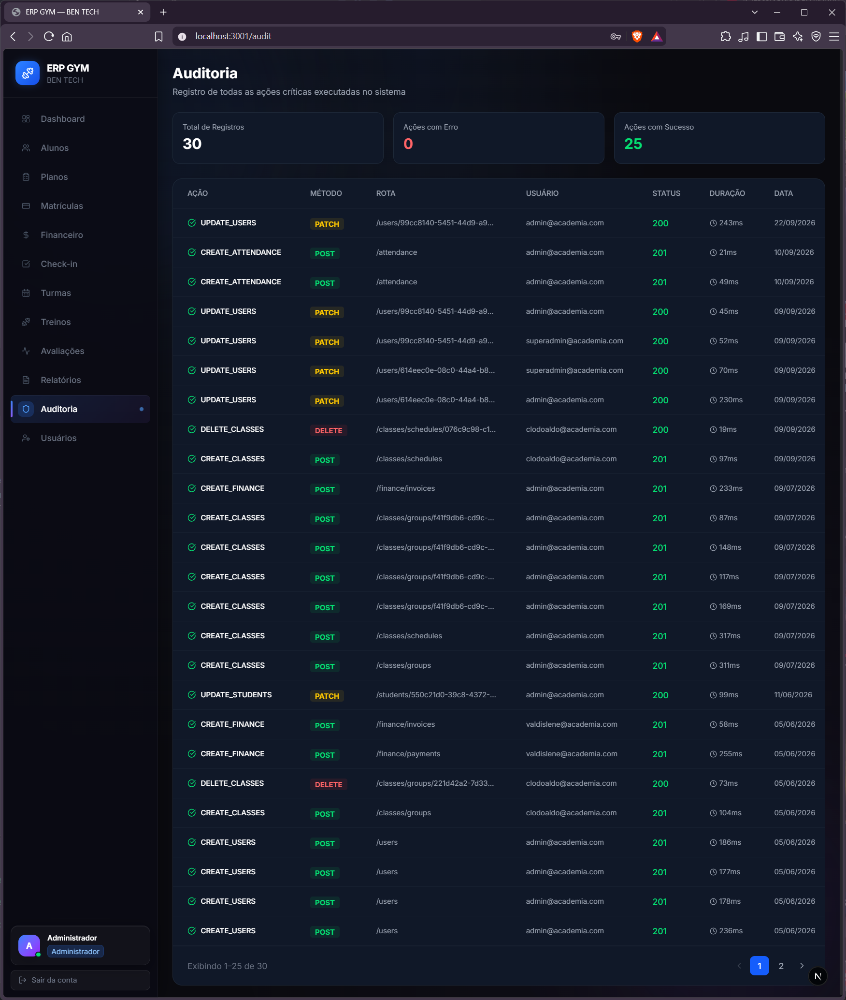 |

### Usuários

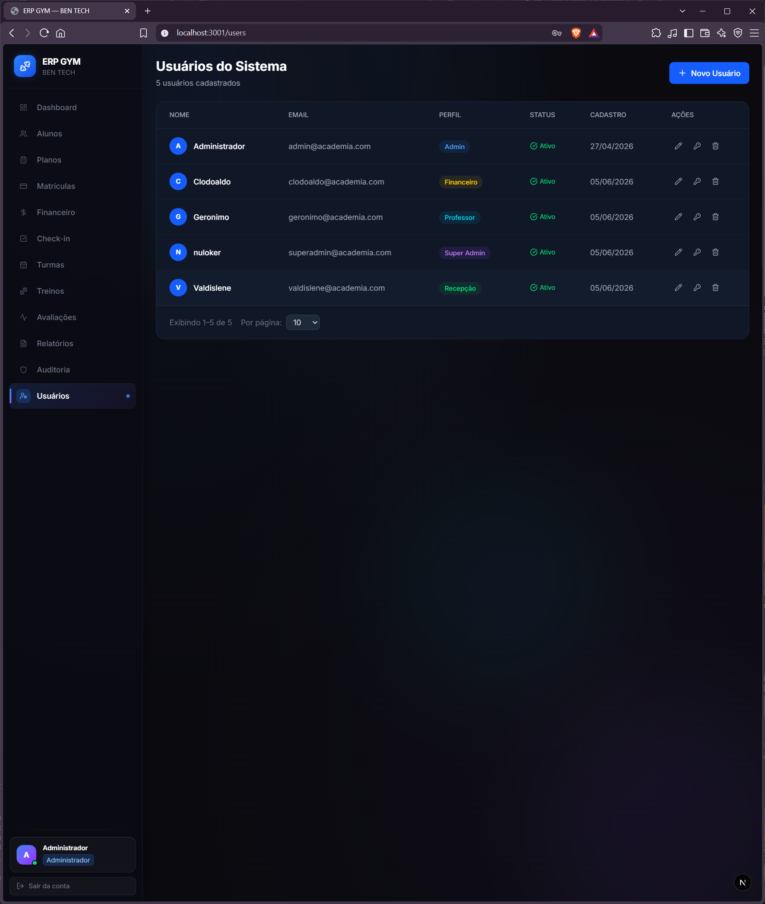

## Estrutura do projeto

```text
erp-gym/
├── apps/
│   ├── api/              # API NestJS e regras de negócio
│   └── web/              # Interface Next.js
├── packages/             # Código compartilhado
├── docker/               # Configuração do banco local
├── scripts/              # Seeds e tarefas auxiliares
└── docs/                 # Materiais complementares
```

O projeto utiliza **pnpm workspaces**.

A API atende na porta `3000` e o frontend na porta `3001`.

## Funcionamento geral

O fluxo principal da aplicação funciona da seguinte forma:

```text
Frontend (Next.js)
        │
        │ HTTP + JWT
        ▼
API (NestJS)
        │
        ├── Autenticação
        ├── Autorização / RBAC
        ├── Validação
        ├── Regras de negócio
        └── Multi-tenancy
        │
        ▼
     TypeORM
        │
        ▼
      MySQL
```

1. O usuário acessa o frontend e realiza o login.
2. A API valida as credenciais e retorna um JWT.
3. O frontend envia o token nas próximas requisições.
4. A API valida a autenticação, o perfil, as permissões e a academia do usuário.
5. O service responsável executa a regra de negócio.
6. O TypeORM consulta ou altera os dados no MySQL.
7. A resposta é enviada para o frontend e a interface é atualizada.
8. Ações importantes são registradas no módulo de auditoria.

## Tecnologias

### Backend

**NestJS 11**, **TypeScript**, **TypeORM**, **MySQL**, **Passport**, **JWT**, **bcrypt** e **Swagger**.

### Frontend

**Next.js 16**, **React 19**, **TypeScript**, **Tailwind CSS 4**, **Axios**, **React Hook Form**, **Zod**, **TanStack Query**, **Recharts** e **Lucide React**.

### Infraestrutura

**Node.js**, **pnpm**, **Docker** e **Docker Compose**.

## Pré-requisitos

Antes de executar o projeto, é necessário ter instalado:

* Node.js
* pnpm
* Docker
* Docker Compose

O MySQL pode ser executado através do Docker Compose do projeto.

## Instalação

Instale as dependências:

```bash
pnpm install
```

Inicie o banco de dados:

```bash
docker compose -f docker/docker-compose.yml up -d
```

### Variáveis de ambiente — Backend

Configure o arquivo `.env`:

```env
DATABASE_HOST=localhost
DATABASE_PORT=3306
DATABASE_USERNAME=root
DATABASE_PASSWORD=senha
DATABASE_NAME=erp_gym
JWT_SECRET=chave-secreta
JWT_EXPIRATION=24h
PORT=3000
CORS_ORIGIN=http://localhost:3001
```

### Variáveis de ambiente — Frontend

Configure o arquivo `.env.local`:

```env
NEXT_PUBLIC_API_URL=http://localhost:3000/api
```

## Executar

Para iniciar a API:

```bash
pnpm dev:api
```

Para iniciar o frontend:

```bash
pnpm dev:web
```

### Endereços

* **Web:** `http://localhost:3001`
* **API:** `http://localhost:3000`
* **Swagger:** `http://localhost:3000/api/docs`

## Comandos úteis

```bash
pnpm build:api
pnpm build:web
pnpm lint
pnpm test
pnpm seed
```

## Documentação

* [DOCUMENTATION_API.md](DOCUMENTATION_API.md) — documentação do backend e seus módulos.
* [DOCUMENTATION_WEB.md](DOCUMENTATION_WEB.md) — documentação do frontend e suas telas.
* [ARQUITETURA.md](ARQUITETURA.md) — visão arquitetural do projeto.
* [DEPLOYMENT.md](DEPLOYMENT.md) — documentação de implantação.

## Sobre o projeto

O **ERP GYM** foi desenvolvido como um projeto full-stack com foco em arquitetura de software, autenticação e autorização, RBAC, multi-tenancy, desenvolvimento de APIs e construção de interfaces web.
